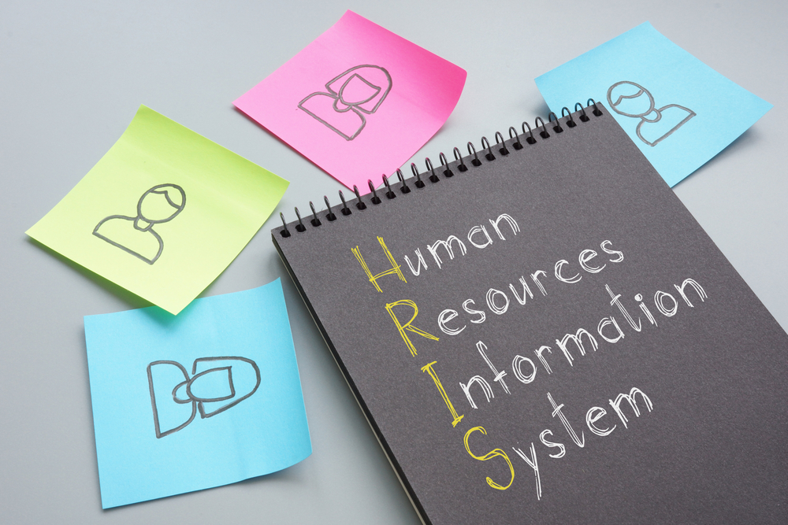
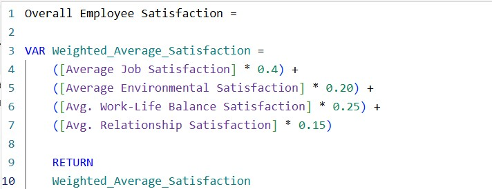
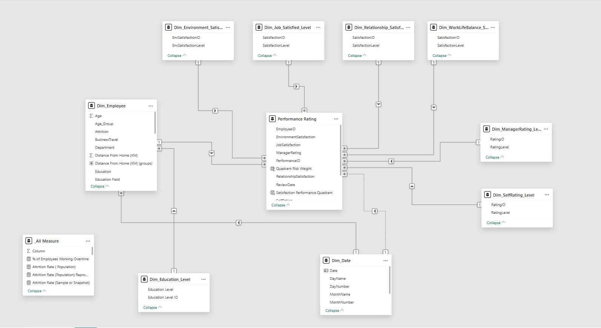
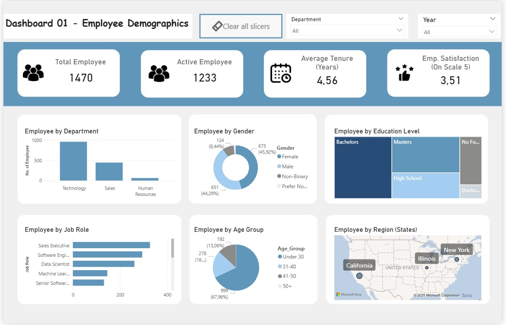
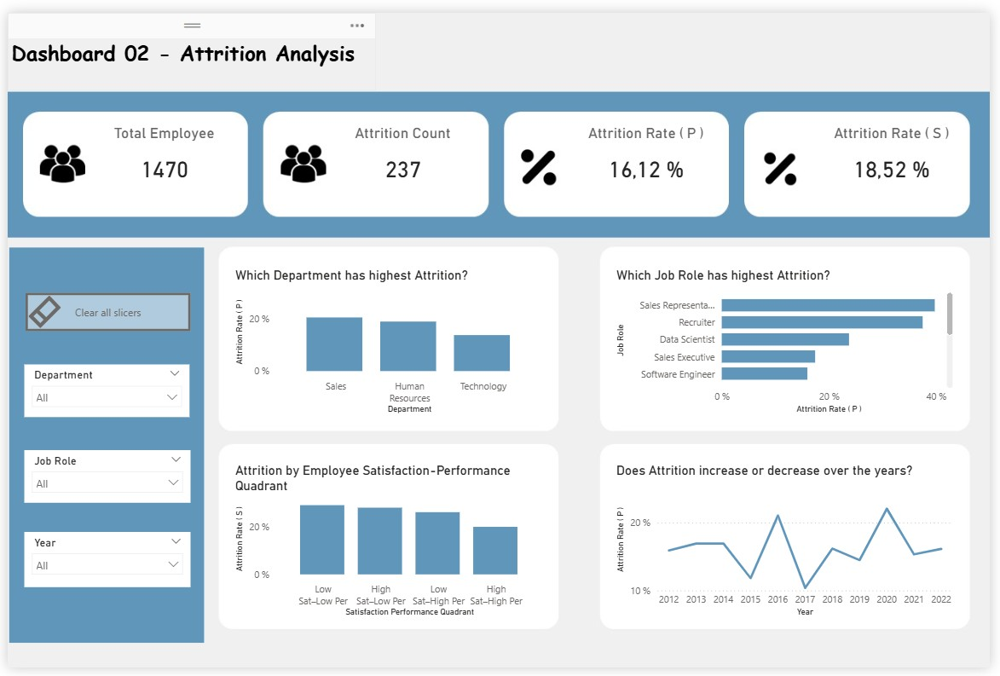
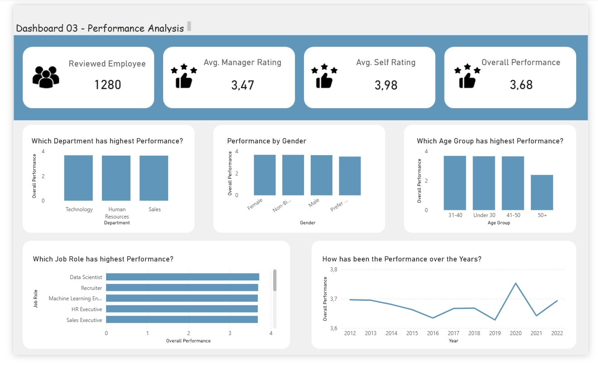

# Power-BI-Portfolio_HR-Analytics-Project

## Introduction & Project Overview ##

**SH Group**, founded in 1982, is a multinational retail organization operating across multiple regions with a large and diverse workforce. Over the years, the company has accumulated a significant volume of data across its core business functions, including Sales, Marketing, Finance, and Human Resource Management.

As the organization continued to grow, HR leadership identified the need for a data-driven approach to workforce management. Traditional reporting methods were no longer sufficient to provide timely and actionable insights into employee demographics, performance trends, satisfaction levels, and workforce stability.

To address this challenge, an HR Analytics initiative was launched to consolidate and analyze employee-related data. The objective of this project was to transform raw HR data into meaningful insights that support strategic decision-making in areas such as employee retention, performance management, and workforce planning.

Using Power BI, this project analyzes key HR datasets covering employee profiles, performance reviews, satisfaction levels, and education background. The resulting dashboards enable HR managers and senior leadership to:

📈 Understand workforce composition and demographics

🔍 Identify performance and satisfaction trends, patterns, and drivers

🎯 Support proactive planning and retention strategies

This project demonstrates how business intelligence (BI) tools can be applied to HR data to improve organizational effectiveness and align people strategies with business goals.

## 🛠️ Skills Demonstrated ##

This project demonstrates the end-to-end Power BI workflow, covering data preparation, modeling, analysis, and dashboarding.

### 🔄 Data Preparation / ETL Process (Power Query) ###

+ 📥 Extracted raw HR data from the web and created Fact and Dimension tables.

+ 🧹 Cleaned and transformed data: removed unnecessary columns, handled blanks/errors, replace abbreviations, created custom columns, ensured correct data types etc.

+ 🔑 Created duplicate dimension table to build proper data model. Removed duplicates from dimension tables to maintain integrity.

  

### 🗂️ Data Modeling ###

+ 📅 Built separate Date Tables (Dim_Date) for accurate time-based analysis (Year-over-Year, Qtr-Over-Qtr, Month-over-Month).

+ ⭐ Designed a Star-Oriented Fact Constellation Schema with multiple fact tables (Fact_Employee & Fact_Performance Rating) and dimension tables (Dim_Date Table, Dim_Manager_Rating Table, Dim_Self_Rating Table, etc.).

+ 🔗 Established 1-to-many and one-way filter propagation relationships for consistent and correct insights.

### 📊 Data Analysis (DAX) ###

+ ➕ Created calculated columns and measures: By applying DAX Formulas and Functions, we have computed core metrics like Total Employees, Reviewed Employees, Attrition Count, Attrition Rate (Population), Attrition Rate (Sample), Attrition Risk, Overall Employee Satisfaction, Overall Employee Performance, Average Salary, Average Tenure etc.

+ 🧮 Applied functions like CALCULATE, AVERAGE, AVERAGEX, DIVIDE, DISTINCTCOUNT, SELECTEDVALUE, SWITCH, MINX, MAXX, UNION, SELECTCOLUMNS, ADDCOLUMNS etc.
  We have also used variables to store the temporary results of a calculation so that we can reduce the no. of measure. 

+ ⏳ Enabled time intelligence with CALENDAR, YEAR, MONTH, DAY, FORMAT etc.

  

### 📈 Data Visualization ###

+ 📉 Line Charts → To show Attrition, Performance, and Satisfaction Trends over time (Year-over-Year, Month-over-Month, Quater-over-Quater).

+ 🗂️ Cards → To demonstrate Key KPIs (Total Employee's, Reviewed Employee's, Attrition Count, Attrition Rate, Overall Employee Satisfaction, Overall Employee Performance etc.).

+ 📊 Bar/Column/Cluster Column/Stacked Bar Charts → To compare Attrition, Performance, Satisfaction by Department, Job Role, Gender, Age Group etc.

+ 🥧 Pie Chart → To exhibit part-to-whole composition. For Example, Employee by Gender, Age Group, Ethnicity etc.

     We have also demonstrated other important visuals like Map Chart, Treemap, Matrix, Table etc. However, we try to use common charts most so that
     different   stakeholders or non-technical people can easily understand the essence. 

### 🎛️ Interactive Dashboard ###

+ 🎛️ Added slicers, drill-downs, drill-through, tooltips, and navigation buttons for interactivity.

+ 🎨 Delivered a business-friendly, interactive dashboard that supports strategic decision-making.

## Data Structure / Model Overview ##

The data model for this HR Analytics project was designed using Power BI best practices, focusing on clarity, correctness, and maintainability. A star-schema–oriented structure was implemented to ensure predictable filter behavior, good performance, and minimal DAX complexity.

The model is centered around a FactPerformanceRating table containing employee performance review data, supported by several dimension tables, most notably Fact_Employee (act as _Dim Table also) and Dim_Date.

*Key modeling decisions and activities include:*

+ A single Date dimension table was used to support both Hire Date and Performance Review Date, enabling consistent time-based analysis.

+ Mixed regional date formats (EU and US) were standardized during Power Query (M) data preparation using locale-aware transformations.

+ Relationships were designed as one-to-many and single-directional (dimension → fact) to preserve model stability and avoid ambiguous filter propagation.

+ Role-playing dimension tables were intentionally implemented for satisfaction and rating attributes:

    + The original Satisfaction Level dimension was duplicated into separate dimension tables for Job
     Satisfaction, Work-Life Balance, Work Environment Satisfaction, and Relationship Satisfaction.

    + Similarly, the Rating Level dimension was duplicated to support Manager Rating and Self Rating
     independently.

     This approach avoided reliance on inactive relationships and repeated use of USERELATIONSHIP() or other complex DAX patterns.

+ Lookup dimensions (Satisfaction Level, Rating Level, Education Level) were used for semantic clarity and clean slicing, rather than forcing complex filtering logic in measures.

Overall, the model follows a “model-first, simple DAX” philosophy, reflecting real-world BI practices where strong data modeling significantly reduces the need for complex calculations while improving reliability and explainability.  

## Analytical Approach & Assumption ##

The analysis in this project follows a business-driven, assumption-aware approach, ensuring that insights are both analytically correct and practically interpretable.

+ Analysis was structured around clear business questions, such as:
  
    + **Demographics Analysis:** Who are our employees? How is the composition of our workforce?
      
    + **Attrition Analysis:** What is our overall attrition rate? Who are leaving? Why are they leaving? Which Departments/Job Role has high Attrition Risks?

    + **Performance Analysis:** How is the performance of our employees? Is it improving or declining over time? Who are performing well? What are the Performance drivers?
      
    + **Satisfaction Analysis:** How satisfied are our employees? Is Satisfaction improving or declining over time? Who are satisfied and who are not?
 
    + **Attrition vs Performance or Satisfaction:** Do dissatisfied employees leave more often? Is attrition linked to employee performance?

+ A clear distinction was maintained between all employees and reviewed employees to avoid biased calculations, as not all employees were considered for performance review. Employee-centric KPIs or Visual's (Total Employees, Active Employees) were calculated from Dim_Employee, where Employee-Performance or Employee-Satisfaction related KPIs or Visual's (Reviewed Employee) were calculated from Fact_PerformanceRating Table.

+ For Satisfaction, we had four factors in our data: Job Satisfaction, Work-Life Balance, Work-Environment Satisfaction, Work-Relationship Satisfaction. Each factor has rated by scale between 1-5. We have taken the weighted average for computing "Overall Employee Satisfaction" where we have given highest weight to Job Satisfaction (0.4), followed by Work-Life Balance (0.25), Work-Environment Satisfaction (0.20), and Work-Relationship Satisfaction (0.15).

+ For Performance, we had two factors in our data: Manager-Rating & Self-Rating. Each factor has rated by scale between 1-5. We have taken the weighted average for computing "Overall Employee Performance" where we have given highest weight to Manager Rating (0.6), followed by Self-Rating (0.40).

+ Satisfaction factors were analyzed individually against attrition, compared using consistent visuals and scales. The result was interpreted through trend consistency, not composite scoring. Composite satisfaction indices were explored but excluded due to over-engineering.

+ Summary insights were prioritized over exhaustive visuals. A high-level summary dashboard was created, Supporting analyses were moved to detail pages or tooltips.

+ Results were validated by comparing trends across multiple satisfaction dimensions, checking consistency between employee-level KPIs and filtered subsets, and ensuring logical alignment (e.g., lower satisfaction aligning with higher attrition).

+ Visual correlation is sufficient for Business Intelligence use cases. No statistical correlation or predictive modeling was assumed or required for this project.

## Dashboard Overview: Key Insights ##

### Demographics Insights: ###

This is our demographics insights dashboard. It highlights key KPIs like Total Employee, Active Employee, and Average Tenure. This also show several important visuals like Employee by Department, Job Role, Gender, Age Group etc. The Dashboard shows following insights: 

+ The organization’s workforce is primarily concentrated in Technology, followed by Sales and Human Resources, indicating a strong technical and commercial orientation. At the job-role level, Sales Executives represent the largest employee group, followed by software and data-related roles such as Software Engineers, Data Scientists, and Machine Learning Engineers.

+ Gender representation across the organization is relatively balanced, with male and female employees accounting for comparable proportions of the workforce. Additionally, a meaningful share of employees identify as non-binary, while a small percentage chose not to disclose their gender, reflecting a diverse workforce composition.

+ From an age perspective, the workforce skews young. Nearly two-thirds of employees are under the age of 30, while mid-career professionals (ages 31–40) and senior professionals (ages 41–50) make up a smaller share. This age distribution has important implications for retention, performance, and satisfaction trends observed later in the analysis.

### Attrition Insights: ###

This is our attrition analysis dashboard. It highlights KPIs like Total Employee, Attrition Count, Attrion Rate (P), Attrition Rate (S). Here P means Population and S means Sample. It also shows some important visuals like Attrition over time, Attrition by Department, Job Role, and Employee Satisfaction-Performance Quadrant. We have also deep dive for Attrition - Who is leaving? Why are they leaving?  Does Satisfaction or Performance has influence on Attrition. The following image shows that deep-dive analysis. 

The Dashboard and Deep-Dive Analysis shows following Insights: 

+ Attrition is not evenly distributed across departments or roles. Sales exhibits the highest attrition rate, followed by Human Resources and Technology. This departmental pattern is mirrored at the job-role level, where Sales Representatives experience the highest attrition, followed by recruiters and technical roles such as data scientists.

+ While Sales has the highest absolute attrition, attrition risk relative to department size is highest in HR, followed by Technology and Sales. This suggests that smaller departments may face proportionally greater retention challenges.

+ Attrition trends over time show significant year-to-year volatility, with no consistent upward or downward pattern. This indicates that attrition is likely driven by multiple structural and behavioral factors rather than a single long-term trend.

+ Demographically, younger employees (under 30) and employees with shorter tenure (0–1 years and 2–5 years) are significantly more likely to leave the organization, highlighting early-career retention as a key challenge.

+ Performance and satisfaction play a critical role in attrition behavior. Employees at both performance extremes—those rated “Above and Beyond” as well as those “Needing Improvement”—exhibit higher attrition. From a satisfaction standpoint, very dissatisfied employees are the most likely to leave.

+ When performance and satisfaction are analyzed together, the highest attrition occurs among employees with low satisfaction and low performance, followed by high satisfaction–low performance and low satisfaction–high performance groups. Employees with high satisfaction and high performance show the lowest attrition, reinforcing the combined importance of engagement and effectiveness.

+ Additionally, operational factors such as overtime, frequent business travel, and lower salary levels show a strong association with higher attrition, suggesting that workload intensity and compensation competitiveness are key retention drivers.

   
### Performance Insights: ###

This is the Employee Performance insights dashboard. It highlights Key KPIs like No. of Reviewed Employees, Avg. Manager-Rating, Avg. Self-Rating, and Overall Performance. It also depicts some key Visuals like Performance Trends, Performance by Gender, Age Group, Department etc. Key Insights are described below: 

+ Overall employee performance has fluctuated considerably over the past decade, reflecting periods of both decline and recovery. Performance declined steadily from 2012 to 2016, improved modestly until 2018, declined again in 2019, and then showed sharp volatility between 2020 and 2022.

+ A notable and unexpected finding is that **female employees consistently outperform male employees**, challenging common assumptions and highlighting the importance of inclusive performance evaluation.

+ Performance also varies by age group. **Mid-career professionals (ages 31–40) demonstrate the strongest performance outcomes, outperforming both younger employees and older age groups**. Performance declines noticeably among employees aged 50 and above.

+ At the departmental level, the Technology department outperforms both Sales and HR, while Sales and HR exhibit similar performance levels.

+ To understand performance drivers, the analysis examined education, experience, and training. Experience and training participation show a clear positive relationship with performance, while formal education level does not. Interestingly, **employees with no formal qualifications show the highest performance**, followed by bachelor’s and doctoral degree holders, suggesting that practical experience and skill development may outweigh formal education in this context.

### Satisfaction Insights: ###

This is the Employee Satisfaction insights dashboard. It highlights Key KPIs like Overall Employee Satisfaction, Avg. Job Satisfaction, Avg. Work-Life Balance, and Avg. Work-Environment Satisfaction. It also depicts some key Visuals like Satisfaction Trends over time, Satisfaction by Gender, Age Group, Department etc. Key Insights are described below: 

+ Employee satisfaction has fluctuated over time, but the overall trend shows improvement in recent years, indicating positive momentum in employee engagement.

+ Satisfaction varies across age groups, with older employees (50+) reporting higher satisfaction levels compared to younger and mid-career employees. This may reflect greater job stability or adjusted expectations over time.

+ Gender-based satisfaction differences are relatively small. However, female employees report slightly higher satisfaction levels than male employees, aligning with observed performance patterns.

## Dashboard Overview: One Level Details / Deeper Insights ##

Each Dashboard can also be drill-down by a specific Year or Department or Job Role to see a particular details. Results can vary significantly compared to the overall dataset, allowing deeper exploration of temporal and local analysis. We also have relevant additional analysis which you can drill-through from Dashboard, for example, you can drill-through to "Performance Drivers" Page from "Performance Dashboard". In addition to Drill-Through, there are also some additional pages where we performed deeper analysis. For instance, Attrition Rate per Satisfaction-Performance Quadrant per Job Role, Attrition Risk Index for Department or Job Role etc. To see the full details, we recommend to download the complete Dashboard (.pbix file).

## Conclusion ##

This HR Analytics project demonstrates how well-structured data modeling and clear analytical framing can answer complex people-related questions without relying on overly complex calculations. By prioritizing business questions first, designing a clean star-schema–based model, and leveraging context-aware measures, the analysis delivers insights that are both reliable and decision-ready.

Rather than chasing complexity for its own sake, the project shows that most analytical value comes from correct grain definition, filter propagation control, and role-aware dimensions. This approach mirrors real-world BI environments, where maintainability, clarity, and performance matter as much as analytical depth. The resulting dashboard enables stakeholders to understand who is leaving, why they are leaving, and where intervention would have the highest impact.

### Key Takeaways from this project ###

+ **Data modeling drives analytics, not DAX complexity:** By investing time in relationship design, role-playing dimensions, and proper filter flow, most insights were achieved using simple, readable measures, reflecting real-world BI best practices.

+ **Business logic must be embedded in the model, not the visuals:** Concepts such as latest review only, reviewed vs all employees, and attrition definitions were handled at the model/measure level to ensure consistency across all visuals.

+ **Intentional duplication of dimension tables can reduce analytical risk:** Separate role-playing dimensions (e.g., Satisfaction Level and Rating Level) were deliberately created to avoid inactive relationships and complex DAX, improving clarity, scalability, and correctness.

+ **Correlation is framed visually, not statistically, for decision-makers:** The analysis focuses on pattern recognition and comparative trends, which is more aligned with executive BI usage than academic statistical modeling.

+ **A senior BI mindset prioritizes explainability over cleverness:** Every metric and visual in the report can be explained in plain business language, ensuring trust, adoption, and long-term usability.

+ **Assumptions are explicitly stated and consistently applied:** Clear assumptions around population scope, time relevance, and evaluation criteria ensure transparency and analytical integrity.

Overall, this project improved both my technical Power BI skills and my ability to think from a business perspective. It reflects my ability to design, build, and deliver BI solutions that not only visualize data but also provide meaningful insights for strategic planning.
